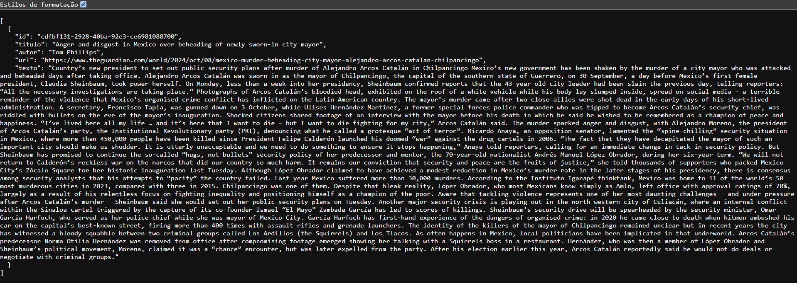
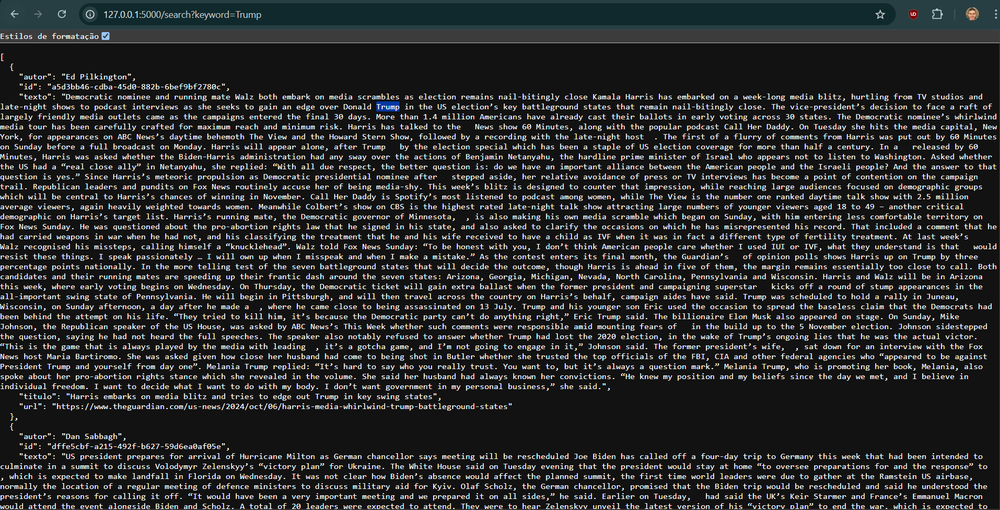
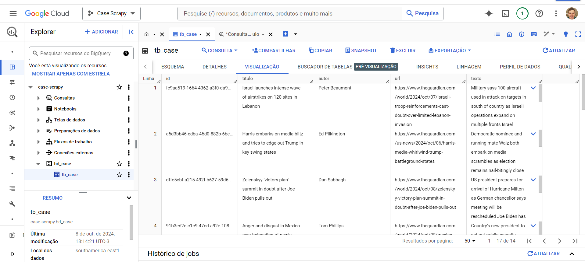
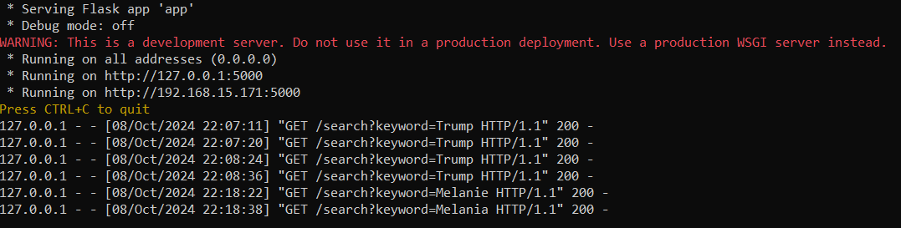
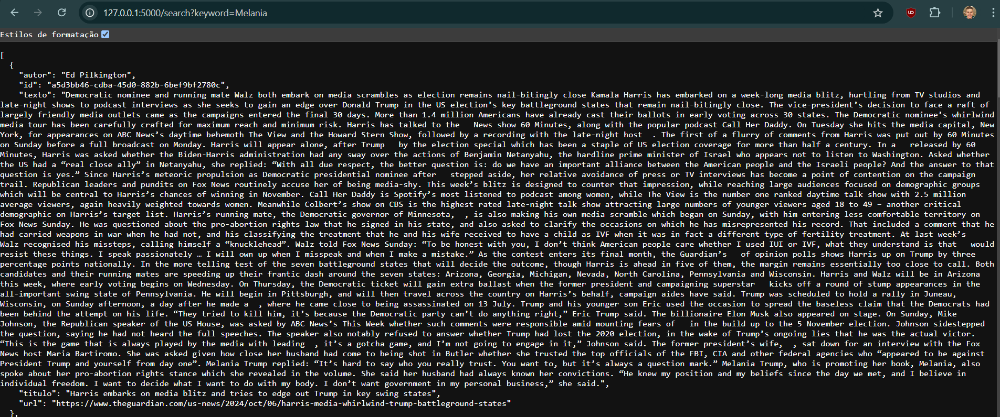

# Case_Lima - Web Scrapping e API
Case para avaliação em habilidades de engenharia de dados, webscraping utilizando Scrapy com nuvem GCP. Para funcionar o scrapping em ambiente local, algumas alterações precisam ser feitas nos arquivos guardian_article.py (arquivo que faz o scrapping) e app.py (API que permite consultar os artigos, o objetivo bônus.), essas mudanças estão listadas na seção de Observações.

Serão usados artigos do site https://theguardian.com o qual serão extraídos: título do artigo, autor, url e texto do artigo sendo inseridos em uma tabela criada no GCP. O campo de id é gerado automaticamente por ser uma chave primária, como exemplificado em JSON na imagem abaixo.




Bônus
Escreva uma API que forneça acesso ao conteúdo do banco de dados BigQuery. O usuário deve ser capaz de pesquisar artigos por palavra-chave. Foi escrita uma API usando Flask o qual permite a pesquisa por palavras chaves no conteudo dos artigos, no exemplo abaixo foi utilizada a palavra 'Trump'. http://127.0.0.1:5000/search?keyword=Trump




# Pré requisitos
Clone o repositório

```
git clone "https://github.com/willrob04/Case_Lima.git"
```
Caso não tenha alguma das bibliotecas, faça a instalação.
```
pip install scrapy
```
```
pip install Flask
```
```
pip install uuid
```
```
pip install db-dtypes
```
```
pip install google-cloud-bigquery
```

# Execução

# Execução do arquivo guardian_article.py onde faz todo o processo de webscrapping e insere os dados em uma tabela no GCP
Navegue para o diretório do projeto, onde ele foi extraido e execute o arquivo:
```
scrapy crawl guardian_article
```
Caso quiser executar o arquivo e gerar um arquivo JSON com a saída:
```
scrapy crawl guardian_article -o exemplo.json
```
Quando terminar a execução, vai inserir os dados na tabela:



# Bonus - API usando Flask para filtrar por palavra-chave no conteúdo do artigo.
Esteja no diretório do projeto e execute o seguinte código.
```
python app.py
```


Aperte Ctrl + C quando carregar a página 
Após acesse o link http://127.0.0.1:5000/search?keyword=Melania o qual irá substituir a keyword pelo termo desejado no artigo.




# Observações - Alterações para funcionar em sua máquina.

# guardian_article.py
Nesse trecho é necessário colocar o caminho do seu arquivo de credenciais JSON do Google Cloud, caso não tenha siga os passos mais abaixo.
os.environ["GOOGLE_APPLICATION_CREDENTIALS"] = "C:\\seu_caminho\\seu_caminho\\sua_chave_aqui.json"

Nesse arquivo é necessário setar os valores de ID do projeto, ID do dataset e ID da tabela.
* self.bq_client = BigQueryClient('id_projeto') 
*  self.dataset_id = 'id_dataset'  
* self.table_id = 'id_tabela'      


# app.py
Nesse trecho é necessário colocar o caminho do seu arquivo de credenciais JSON do Google Cloud, caso não tenha siga os passos mais abaixo.
os.environ["GOOGLE_APPLICATION_CREDENTIALS"] = "C:\\seu_caminho\\seu_caminho\\sua_chave_aqui.json"

* client = bigquery.Client(project='id_projeto')  # Substitua pelo seu ID do projeto
* dataset_id = 'id_dataset'  # Substitua pelo seu ID do dataset
* table_id = 'id_tabela'     # Substitua pelo seu ID da tabela


# Caso não tenha o arquivo de credenciais do BigQuery:
* Baixando o Arquivo de Credenciais:
* Acesse o Google Cloud Console:
* Vá para Google Cloud Console.
* Selecione seu Projeto:
* No menu suspenso de seleção de projeto, escolha o projeto que você está usando.
* Navegue até IAM & Admin:
* Clique em "IAM & Admin" no menu à esquerda e, em seguida, em "Service Accounts".
* Crie uma Nova Conta de Serviço (se você ainda não tiver uma):
* Clique em "Criar Conta de Serviço".
* Preencha os campos necessários e clique em "Criar".
* Conceda Permissões:
* Adicione permissões necessárias, como BigQuery Admin ou BigQuery Data Editor, e clique em "Continuar".
* Crie uma Chave:
* Após a criação da conta, você verá uma opção para "Adicionar Chave". Clique em "Adicionar Chave" e escolha "JSON". Isso fará o  download do arquivo JSON para o seu computador.
* Atualize o Caminho para as Credenciais:
* Certifique-se de que o caminho especificado em seu código (ou na variável de ambiente GOOGLE_APPLICATION_CREDENTIALS) aponta para o local correto onde você salvou o arquivo JSON.

# Caso não saiba criar o projeto, database e a tabela:
* Para encontrar o project_id, dataset_id e table_id necessários para configurar seu cliente do BigQuery, siga estas etapas:
* Encontrar o Project ID
* Acesse o Google Cloud Console: Vá para Google Cloud Console.
* Selecione seu Projeto: No canto superior esquerdo, clique no menu suspenso de seleção de projeto. O ID do projeto será exibido ao lado do nome do projeto. Você pode copiar este ID.

* Criar um Dataset
* Se você ainda não tem um dataset:
* No Console do GCP:
* Navegue até "BigQuery".
* No painel esquerdo, clique em seu projeto.
* Clique em "Criar Dataset".
* Dê um nome ao seu dataset (este será o dataset_id) e configure as opções conforme necessário. Após criar, você verá seu novo dataset listado.
* Criar uma Tabela

* Se você ainda não tem uma tabela:
* No Console do GCP:
* Clique no seu dataset recém-criado.
* Clique em "Criar Tabela".
* Preencha as informações necessárias (como nome da tabela, esquema, etc.). O nome que você der à tabela será o table_id.
* Resumo dos IDs
* project_id: O ID do projeto que você encontrou no Console do GCP.
* dataset_id: O nome do dataset que você criou.
* table_id: O nome da tabela que você criou dentro do dataset.


